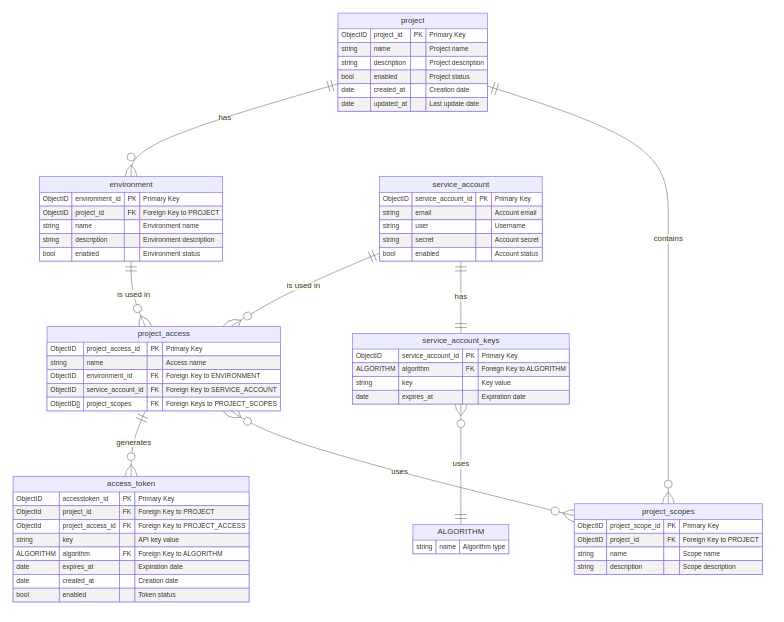

# Buraq

A Rust project managed with Devbox for consistent development environments.

## Prerequisites

- [Devbox](https://www.jetify.com/docs/devbox/installing_devbox/) - A development environment manager

## Installation

1. Install Devbox by running:
```bash
curl -fsSL https://get.jetify.com/devbox | bash
```

2. Clone this repository:
```bash
git clone <repository-url>
cd buraq
```

## Environment Setup

Before running any Devbox scripts, make sure to:

1. Copy the example environment file:
```bash
cp .env.example .env
```

2. Update the `.env` file with your specific configuration values.

## Available Devbox Scripts

The following scripts are available through Devbox:

- `devbox run test` - Run the test suite (includes Docker services)
- `devbox run start` - Start the application (includes Docker services)
- `devbox run shutdown` - Shutdown Docker services

### Script Details

- **test**: Runs the test suite for the project
- **start**: 
  - Starts required Docker services
  - Runs the Rust application
  - Automatically shuts down Docker services when the application exits
- **shutdown**: Manually stops all Docker services

## Development

To start a development shell with all required dependencies:

```bash
devbox shell
```

This will provide you with a shell environment containing:
- Rust toolchain (via rustup)
- All other project dependencies

If it's the first time running the development shell 

run the following command to initialize your rust environment 

```
rustup default stable 
```

## Entity Relationship Diagram




The database schema is defined in `docs/erd/erd.mmd` and visualized above. The diagram shows:

- All database entities and their fields
- Relationships between entities
- Primary and foreign key constraints

To regenerate the diagram from the source file, you'll need:

Run: `mmdc -i docs/erd/erd.mmd -o docs/erd/erd.png`

